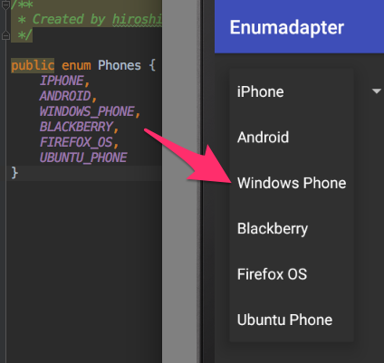

# Enumadapter [](https://jitpack.io/#kikuchy/Enumadapter)

The easiest way to make Enum's ListView or Spinner for Android.




## Why use Enumadapter?

[ArrayAdapter](https://developer.android.com/reference/android/widget/ArrayAdapter.html) shows results of `Object.toString()`.
It's usefull to make list from `Enum.values()`, but we cannot shows localized Resource's string directly.

Enumadapter allows to you making Resource replesented Enum values list!!


## Usage

```java
// in your Activity
SpinnerAdapter adapter = new EnumArrayAdapter<>(this, android.R.layout.simple_spinner_dropdown_item, Phones.values(), new ResourceStringify<Phones>(this) {
    @Override
    public int getStringResource(Phones target) {
        int res = 0;
        switch (target) {
            case IPHONE: res = R.string.iphone; break;
            case ANDROID:res = R.string.android; break;
            case WINDOWS_PHONE: res = R.string.windows_phone; break;
            case BLACKBERRY: res = R.string.blackberry; break;
            case FIREFOX_OS: res = R.string.firefox_os; break;
            case UBUNTU_PHONE: res = R.string.ubuntu_phone; break;
        }
        return res;
    }
});
```


## Install

Add it in your root build.gradle at the end of repositories:

```groovy
	allprojects {
		repositories {
			...
			maven { url "https://jitpack.io" }
		}
	}
```

and add the dependency in your project local build.gradle

```groovy
	dependencies {
	        compile 'com.github.kikuchy:Enumadapter:0.0.1'
	}
```

## License

```
Copyright 2016 kikuchy

Licensed under the Apache License, Version 2.0 (the "License");
you may not use this file except in compliance with the License.
You may obtain a copy of the License at

http://www.apache.org/licenses/LICENSE-2.0

Unless required by applicable law or agreed to in writing, software
distributed under the License is distributed on an "AS IS" BASIS,
WITHOUT WARRANTIES OR CONDITIONS OF ANY KIND, either express or implied.
See the License for the specific language governing permissions and
limitations under the License.
```
